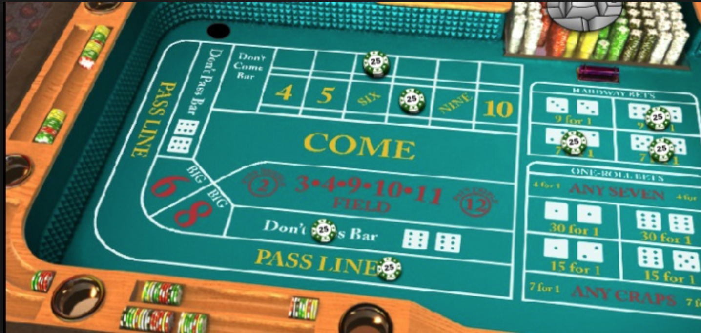
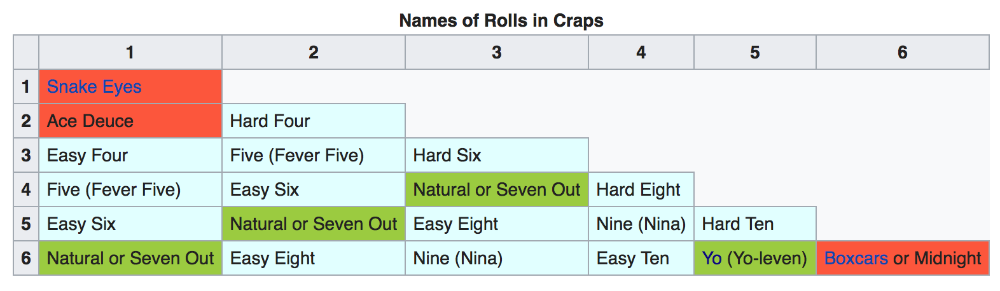

# Craps for Android :money_with_wings:

This is an Android app of a Monte Carlo simulation for the casino game [craps](https://en.wikipedia.org/wiki/Craps).

The simulation keeps track of three things:

- wins 
- games played
- the percentage of games won

It features three main buttons in its GUI interface:

- Play, rolls for one game
- Run, turns continuous games on or off, to play as many games as possible while turned on
- Reset, resets the counter of wins, games, and percent

The GUI features colors (green for win and red for loss), svg icon graphics, and a list of rolls for the most recent game played.

#### TO-DO

- Set an amount of money (for example $1000), and a bet (example $1), and run continuous mode to simulate wins and losses that add or reduce the amount of money. Then see how many games can be played until running out of money.
- Implement the more complex bets and wins for craps, such as:
  - [Yo-leven](https://en.wikipedia.org/wiki/Yo-leven)
  - Names of the roll
    - 
- Implement advanced features with randomness so the computer makes bets to field, Yo-level bets, etc. and how that effects number of rolls to be played.
  - Add feature that makes the computer take riskier bets more often or less often.